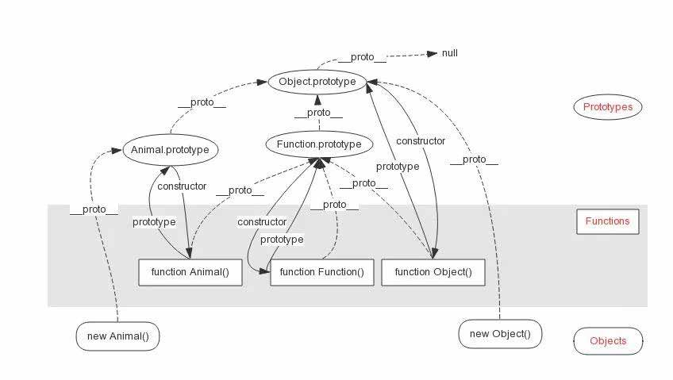

### js原型链

#### 1、JavaScript特点

JavaScript是一门直译式脚本语言，是一种动态类型、基于原型的语言。 JavaScript的灵活性不亚于C++，你可以使用JavaScript尝试不同的程序设计范型。 比如类jQuery风格的函数式编程、基于过程的指令式编程、以及基于原型的面向对象编程。 不同于Java、C#等面向对象语言，JavaScript采用基于原型的继承方式。

#### 2、原型的由来

1994年，网景公司（Netscape）发布了Navigator浏览器0.9版，但是刚开始的Js没有继承机制，更别提像同时期兴盛的C++和Java这样拥有面向对象的概念。在实际的开发过程中，工程师们发现没有继承机制很难解决一些问题，必须有一种机制能将所有的对象关联起来。 Brendan Eich鉴于以上情况，但不想把Js设计得过为复杂，于是引入了new关键词和constructor构造函数来简化对象的设计，引入了prototype函数对象来包含所有实例对象的构造函数的属性和方法，引入了proto和原型链的概念解决继承的问题。

#### 3、原型

- 每个函数都有一个prototype(原型)属性
- 这个属性都有一个指针，指向一个对象
- 这个对象包含由特定类型所有实例共享的属性和方法
- 使用原型的好处是 可以让所有对象实例共享它包含的方法和属性

通过in操作符和hasOwnProperty来判断给定属性是来自于原型还是实例 ， in- true 代表属性在对象中存在 来自实例或者来自原型 ， hasOwnProperty- true代表属性来自于实例 是实例属性

#### 4、原型链

ECMAScript中只支持实现继承，而且是通过原型链的方式来实现的。所以原型链是JavaScript实现继承的一种重要方式。 用户定义类型的原型链 。 我们一般来检查JavaScript的变量数据类型是通过instanceof关键字，可以基于原型链来检测变量的类型。 JavaScript来描述instanceof的实现逻辑是这样的：

```js
function _instanceof(L,R){
    for(L = L.__proto__;L;L=L__proto__){
        if(L===R.prototype)return true;
    }
    return false
}
```



我们可以将__proto__箭头视作泛化（子类到父类）关系！ 图中所有的虚线将构成一个继承层级，而实线表示属性引用。 图中给出了Object.prototype.__proto__ == null，但它还没有标准化，在Chrome、Safari和Node.js下它是不同的东西。 但可以看到JavaScript中所有对象的共同隐式原型为Object.prototype，它的上一级隐式原型是什么已经不重要了， 因为它不会影响所有内置对象以及用户定义类型的原型链结构。 在图中其实已经解释了不同内置对象instanceof的行为，在来看Function和Object的特殊之处：

Object是由Function创建的：因为Object.__proto__ === Funciton.prototype； 同理，Function.prototype是由Object创建的； Funciton是由Function自己创建的！ Object.prototype是凭空出来的！ 现在我们可以解释特殊对象的instance行为了：

```js
//因为Function.__proto__ ===Function.prototype
Function instanceof Function == true
//因为Object.__proto__.__proto__===Object.prototype
Object instanceof Object == true
//因为Function.prototype和Object.prototype同时位于Function和Object的原型链上
Object/Function instanceof Object/Function == true
```

另外可以看到当声明一个函数（比如Animal）时，Animal.prototype会自动被赋值为一个继承自Object的对象， 而且该对象的constructor等于Animal。即：

```js
function Animal(){}
Animal.prototype.constructor === Animal //true
```

值得注意的是Animal如果被Cat继承，Cat实例（比如cat）的constructor仍然是Animal。

```js
function Cat(){}
Cat.prototype = new Animal
var cat = new Cat();
cat.constructor
===Cat.prototype.constructor
===(new Animal).constructor
===Animal.prototype.constructor
===Animal
```
#### 五、总结
+ 每个函数对象都有一个 prototype 属性，这个属性就是函数的原型对象
+ 原型链是JavaScript实现继承的重要方式，原型链的形成是真正是靠__proto__ 而非prototype
