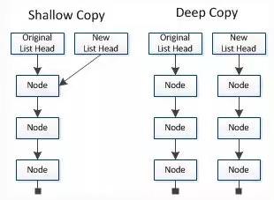

### js浅拷贝和深拷贝

#### 1、数据类型
在js中数据分为基本数据类型 (String, Number, Boolean, Null, Undefined，Symbol)和对象数据类型。

+ 基本数据类型的特点：直接存储在栈(stack)中的数据
+ 引用数据类型的特点：存储的是该对象在栈中引用，真实的数据存放在堆内存里

引用数据类型在栈中存储了指针，该指针指向堆中该实体的起始地址。当解释器寻找引用值时，会首先检索其在栈中的地址，取得地址后从堆中获得实体


#### 2、浅拷贝与深拷贝
深拷贝和浅拷贝是只针对Object和Array这样的引用数据类型的。 示例图如下：



浅拷贝只复制指向某个对象的指针，而不复制对象本身，新旧对象还是共享同一块内存。但深拷贝会另外创造一个一模一样的对象，新对象跟原对象不共享内存，修改新对象不会改到原对象。

#### 3、 赋值和浅拷贝的区别
- 当我们把一个对象赋值给一个新的变量时，赋的其实是该对象的在栈中的地址，而不是堆中的数据。也就是两个对象指向的是同一个存储空间，无论哪个对象发生改变，其实都是改变的存储空间的内容，因此，两个对象是联动的。
- 浅拷贝是按位拷贝对象，它会创建一个新对象，这个对象有着原始对象属性值的一份精确拷贝。如果属性是基本类型，拷贝的就是基本类型的值；如果属性是内存地址（引用类型），拷贝的就是内存地址 ，因此如果其中一个对象改变了这个地址，就会影响到另一个对象。即默认拷贝构造函数只是对对象进行浅拷贝复制(逐个成员依次拷贝)，即只复制对象空间而不复制资源。

##### 对比赋值与浅拷贝对原对象带来的改变

```js
   //对象赋值
    var Tadpole1 = {
        age:23,
        name:"Mr-Chen",
        language:["English","chinese"]
    }
    var Tadpole2 = Tadpole1;
    Tadpole2.age = 18;
    Tadpole2.language.shift()
    console.info(Tadpole1,name,Tadpole1.language)//MrChen ["chinese"]
    console.info(Tadpole2,name,Tadpole2.language)//MrChen ["chinese"]
```

```js
    //浅拷贝
    var Tadpole1 = {
        age:23,
        name:"MrChen",
        language:["English","chinese"]
    };
    var Tadpole3 = shallowCopy(Tadpole1);
    Tadpole3.age = 18;
    Tadpole3.language.shift();
    function shallowCopy(src){
        var dst = {};
        for(var prop in src){
            if(src.hasOwnProperty(prop)){
                dst[prop] = src[prop];
            }
        }
        return dst;
    }
    console.info(Tadpole1.age,Tadpole1.language);//23 ["chinese"]
    console.info(Tadpole3.age,Tadpole3.language);//18 ["chinese"]
```

Tadpole1是原始数据，Tadpole2是赋值操作得到，而Tadpole3是浅拷贝得到。在此归纳总结：

|                 | 和原数据是否指向同一对象|第一层数据为几把呢个数据类型|元数据中包含子对象|
| :--------------- |:-----------------------:|:--------------------------:| ----------------:|
|       赋值      | 是 | 改变时会和原数据一起改变 | 改变时会和原数据一起改变 |
|      浅拷贝     | 否 | 改变时不会改变原数据     | 改变时会和原数据一起改变 |
|      深拷贝     | 否 | 改变时不会改变原数据     | 改变时不会改变原数据     |

#### 4、浅拷贝的实现方式
##### Object.assign()

Object.assign() 方法可以把任意多个的源对象自身的可枚举属性拷贝给目标对象，然后返回目标对象。但是 Object.assign()进行的是浅拷贝，拷贝的是对象的属性的引用，而不是对象本身。

```js
  var Tadpole = {Info:{age:18,name:"MrChen"}}
  var TadpoleObj = Object.assign({},Tadpole);
  TadpoleObj.Info.age = 28;
  console.info(Tadpole.Info.age)//28
```
::: warning 注意
当object只有一层时，是深拷贝
::: 

```js
var Tadpole = {age:18}
    var TadpoleObj = Object.assign({},Tadpole);
    TadpoleObj.age = 28;
    console.info(Tadpole)//{age: 18}
```

##### Array.prototype.concat()
```js
//修改新对象会改到原对象:  
  var arr = [1,2,3]
    console.info(arr.concat([4,5,6]))//[1, 2, 3, 4, 5, 6]
```
##### Array.prototype.slice()
```js
   //修改新对象同样会改到原对象:
    var TadpoleArr = ["帅","逗比",{name:"MrChen"}];
    var TadpoleArr2 = TadpoleArr.slice();
    TadpoleArr2[2].name = "Mr-Chen";
    console.info(TadpoleArr)//["帅","逗比",{name:"Mr-Chen"}]
```
::: tip 补充
Array的slice和concat方法不修改原数组，只会返回一个浅复制了原数组中的元素的一个新数组。
:::
##### 原数组的元素会按照下述规则拷贝：

- 如果该元素是个对象引用(不是实际的对象)，slice 会拷贝这个对象引用到新的数组里。两个对象引用都引用了同一个对象。如果被引用的对象发生改变，则新的和原来的数组中的这个元素也会发生改变。
- 对于字符串、数字及布尔值来说（不是 String、Number 或者 Boolean 对象），slice 会拷贝这些值到新的数组里。在别的数组里修改这些字符串或数字或是布尔值，将不会影响另一个数组。

```js
//举例：
    var Tadpole = ["帅","逗比",{name:"MrChen"}];
    var TadpoleArr2 = TadpoleArr.slice();
    TadpoleArr2[0] = "骚";
    console.info(Tadpole)//["帅","逗比",{name:"MrChen"}]
    console.info(TadpoleArr2)//["骚","逗比",{name:"MrChen"}]
```
#### 5、深拷贝的实现方式

##### JSON.parse(JSON.stringify())
```js
    var Tadpole = ["帅","逗比",{name:"MrChen"}];
    var TadpoleArr3 = JSON.parse(JSON.stringify(Tadpole))
    TadpoleArr3[2].name = "Mr-Chen";
    console.info(Tadpole);//["帅","逗比",{name:"MrChen"}]
    console.info(TadpoleArr3);//["帅","逗比",{name:"Mr-Chen"}]
```
原理：用JSON.stringify将对象转成JSON字符串，再用JSON.parse()把字符串解析成对象，一去一来，新的对象产生了，而且对象会开辟新的栈，实现深拷贝。
::: warning 注意
这种方法虽然可以实现数组或对象深拷贝,但不能处理函数
::: 
```js
 var Tadpole = ["帅","逗比",{name:"MrChen"},function(){}];
    var TadpoleArr3 = JSON.parse(JSON.stringify(Tadpole))
    TadpoleArr3[2].name = "Mr-Chen";
    console.info(Tadpole[3]);//ƒ (){}
    console.info(TadpoleArr3[3]);//null
```
因为JSON.stringify() 方法是将一个JavaScript值(对象或者数组)转换为一个 JSON字符串，不能接受函数。

##### 通过递归方法
```js
    //定义检测数据类型的功能函数
    function checkeType(target){
        return Object.prototype.toString.call(target).slice(8,-1);
    }
    //实现深度克隆---对象/数组
    function clone(target){
        //判断拷贝的数据类型
        //初始化变量result 成为最终克隆的数据
        let result,targetType = checkeType(target);
        if(targetType === "Object"){
            result = {};
        }else if(targetType === "Array"){
            result = [];
        }else{
            return target;
        }
        //遍历目标函数
        for(let i in target){
            //获取遍历数据结构的每一项值
            let val = target[i];
            //判断目标结构中的每一项值是否存在对象/数组
            if(checkeType(val)==="Object"||checkeType(val)==="Array"){//对象/数组中嵌套了对象/数组
                //继续遍历获取到的val值
                result[i] = clone(val);
            }else{
                result[i] = val;
            }
        }
        return result;
    }
```
递归方法实现深度克隆原理：遍历对象、数组直到里边都是基本数据类型，然后再去复制，就是深度拷贝

##### 函数库lodash

```js
//安装
npm install lodash --save 
//执行
   var _ = require("lodash");
    var Tadpole = {
        label:"帅",
        info:{ name:"Mrchen",age:18}
    }
    var Tadpole2 = _.cloneDeep(Tadpole);
    Tadpole2.info.name = "Mr-Chen";
    console.info(Tadpole.info.name === Tadpole2.info.name);//false
//这里的代码用到了require引用依赖，需要模块化打包（webpack/browserify ...）
//npm i -g browserify
//browserify [inputFile] -o [outFile]
```