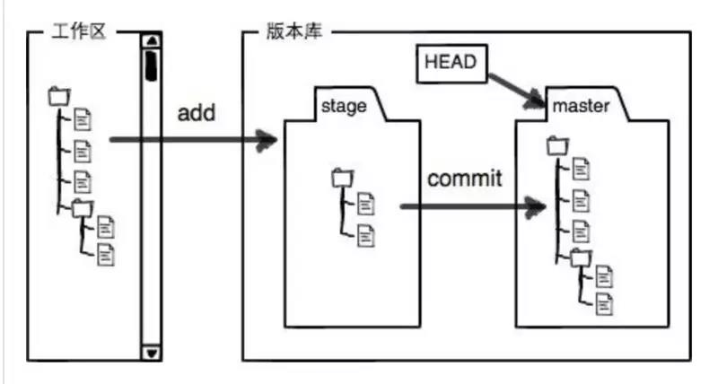

### git常用命令总结

 Git是目前世界上最先进的分布式版本控制系统 ,作为版本控制方面新的里程碑，要比SVN强大、方便很多，在这里对他的一些常用的命令进行总结。
 
 #### 1、Git版本库原理
 Git的版本库里存了很多东西，其中最重要的就是称为stage（或者叫index）的暂存区，还有Git为我们自动创建的第一个分支master，以及指向master的一个指针叫HEAD。 工作区有一个隐藏目录.git，这个不算工作区，而是Git的版本库 。
 
 
 
 #### 2、创建版本库
 ```shell script
#创建文件
$ mkdir app

#进入文件
$ cd app

#初始化代码仓库
$ git init

#把需要提交的所有修改放到暂存区（Stage）
$ git add file

#提交所有文件
#$ git add *

#提交所有.js格式文件
#$ git add *.js

#强制添加（慎用）
#$ git add -f file

#提交代码
$ git commit -m "commit info"
```
#### 3、查看
```shell script
#查看历史记录，git log命令显示从最近到最远的提交日志
$ git log

#查看分支合并图
$ git log --graph

#Git提供了一个命令git reflog用来记录你的每一次命令：
$ git reflog

#git status命令用于显示工作目录和暂存区的状态。使用此命令能看到那些修改被暂存到了, 哪些没有, 哪些文件没有被Git tracked到。git status不显示已经commit到项目历史中去的信息。
$ git status

#当暂存区中没有文件时，git diff比较的是，工作区中的文件与上次提交到版本库中的文件。
#当暂存区中有文件时，git diff则比较的是，当前工作区中的文件与暂存区中的文
$ git diff

#比较工作区中的文件与版本库中文件的差异。HEAD指向的是版本库中的当前版本，而file指的是当前工作区中的文件。
$ git diff HEAD -- file
```
#### 4、版本退回
```shell script
#Git必须知道当前版本是哪个版本，在Git中，用HEAD表示当前版本，上一个版本就是HEAD^，上上一个版本就是HEAD^^，当回退版本较早时可以写成HEAD~100。

#版本回退
$ git reset --hard HEAD^

#取消回退，commitId为你想要回到的未来版本号
$ git reset --hard commitId
```
#### 5、删除文件
命令git rm用于从版本库删除一个文件。如果一个文件已经被提交到版本库，那么你永远不用担心误删，但是要小心，只能恢复文件到最新版本，你会丢失最近一次提交后你修改的内容。
```shell script
#从版本库删除一个文件
$ git rm file
```
#### 6、添加远程仓库
```shell script
#关联一个远程库
$ git remote add origin <address>
#第一次将本地库的所有内容推送到远程库上
$ git push -u origin master [-f]

#此后，每次本地提交后,就可以使用命令推送最新修改
$ git push origin master
```
#### 7、克隆远程仓库
```shell script
$ git clone url
```
比如，要克隆 Ruby 语言的 Git 代码仓库 Grit，可以用下面的命令：
```shell script
#这会在当前目录下创建一个名为grit的目录，其中包含一个.git的目录，用于保存下载下来的所有版本记录，然后从中取出最新版本的文件拷贝。如果进入这个新建的grit目录，你会看到项目中的所有文件已经在里边了，准备好后续的开发和使用。
$ git clone git://github.com/schacon/grit.git
```
如果希望在克隆的时候，自己定义要新建的项目目录名称，可以在上面的命令末尾指定新的名字：
```shell script
#唯一的差别就是，现在新建的目录成了mygrit，其他的都和上边的一样。
$ git clone git://github.com/schacon/grit.git mygrit
```
#### 8、分支管理
创建+切换分支：
```shell script
$ git checkout -b <name>
```
创建分支：
```shell script
$ git branch <name>
```
切换分支：
```shell script
$ git checkout <name>
```
查看分支：
```shell script
#git branch命令会列出所有分支，当前分支前面会标一个*号。
$ git branch
```
合并某分支到当前分支：
```shell script
$ git merge <name>
```
删除分支
```shell script
$ git branch -d <name>
```
Git分支十分强大，在团队开发中应该充分应用。合并分支时，加上—no-ff参数就可以用普通模式合并，合并后的历史有分支，能看出来曾经做过合并，而fast forward合并就看不出来曾经做过合并。

#### 9、储藏
储藏可以获取你工作目录的中间状态——也就是你修改过的被追踪的文件和暂存的变更——并将它保存到一个未完结变更的堆栈中，随时可以重新应用。

现在你想切换分支，但是你还不想提交你正在进行中的工作；所以你储藏这些变更。为了往堆栈推送一个新的储藏，只要运行git stash。把所有未提交的修改（包括暂存的和非暂存的）都保存起来，用于后续恢复当前工作目录。（ 需要说明一点，stash是本地的，不会通过git push命令上传到git server上。 ）
```shell script
$ git stash
```
查看现有的所有储藏，此命令显然暗示了git stash可以多次保存工作进度，并用在恢复时候选择。
```shell script
$ git stash list
```
重新应用已经实施的储藏（不删除储藏）
```shell script
#如果你想应用更早的储藏，你可以通过名字指定它，像这样：git stash apply stash@{2}。如果你不指明，Git 默认使用最近的储藏并尝试应用它
$ git stash apply [--index] [<stash>]
```
重新应用已经实施的储藏（删除储藏）
```shell script
#如果不使用任何参数，会恢复最新保存的工作进度，并将恢复的工作进度从存储的工作进度列表中清除。
#如果提供<stash>参数（来自git stash list显示的列表），则从该<stash>中恢复。恢复完毕也将从进度列表中删除<stash>。
#选项--index除了恢复工作区的文件外，还尝试恢复暂存区。
$ git stash pop [--index] [<stash>]
```
删除一个存储进度（默认删除最新的进度）
```shell script
$ git stash drop [<stash>]
```
清空当前所有的stash
```shell script
$ git stash clear
```
基于储藏进度创建分支
```shell script
$ git stash branch <branchname> <stash>
```

#### 10、多人协作
查看远程库的信息：
```shell script
$ git remote
#或者用git remote -v 可显示更详细的信息
```
推送分支，该分支上的所有本地提交推送到远程库：
```shell script
$ git push origin <branch-name>
```
从本地推送分支，如果推送失败，先抓取远程的新提交：
```shell script
$ git pull
```